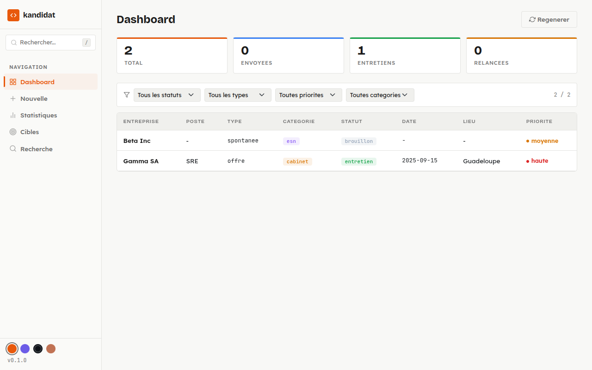

# kandidat


A personal web interface to track and manage job applications.

The idea: a simple, local tool you fully control. No account to create, no SaaS, no dependency on a third-party service. A SQLite database, a Flask server, a browser — that's it.

kandidat lets you centralize your applications, track their progress through a controlled status workflow (draft, sent, followed-up, interview, accepted, rejected, archived), organize target companies by category, manage contacts per company, and keep a full history of every step. The interface is designed for daily use: a filterable dashboard, detailed application pages, attached file management (CV, cover letters, job offers), and statistics to step back and see the big picture.

## Why this project

Existing job application trackers are either too heavy (repurposed CRMs), too limited (spreadsheets), or hosted by a third party (personal data). kandidat was born from a concrete need: a clean web interface that runs locally, with data stored as a SQLite file you can back up, version, or migrate however you want.

The deliberately simple stack (Flask, SQLite, Jinja2, vanilla CSS) is intentional: the code stays readable, modifiable, and extensible without needing to learn a frontend framework or deployment infrastructure.

## Features

- **Dashboard**: sortable and filterable table of all active applications
- **Application detail**: full view with metadata, status history, markdown content, and attached files
- **Status state machine**: controlled transitions (draft -> sent -> followed-up -> interview -> accepted/rejected -> archived)
- **Status history**: vertical timeline of every status change with timestamps
- **File management**: upload, view, and delete attached files (CV, cover letters, offers, notes)
- **Target companies**: organize companies by category (large groups, staffing agencies, companies, recruitment firms) with drag & drop reordering
- **Company detail page**: company information with associated contacts (name, role, email, phone, LinkedIn) and linked applications
- **Statistics**: breakdown by status, type, priority, category, and chronological timeline
- **Full-text search**: search across application content and markdown files
- **Obsidian dashboard**: regenerate an Obsidian-compatible `00-Dashboard.md` with wikilinks
- **Themes**: 4 visual themes (Precision, Vibrant, Dark, Pastel) switchable on the fly
- **REST API**: complete JSON endpoints for all resources (applications, companies, contacts, files, history, stats)
- **CV adaptation via LLM**: automatically adapt a reference CV to a job application context using a configurable LLM (Ollama local or Claude API), with HTML preview before saving
- **PDF & DOCX export**: convert adapted CV to PDF (WeasyPrint with print-safe CSS, A4 layout) and DOCX (semantic HTML parsing, ATS-optimized structure)
- **AI-powered company enrichment**: automatically enrich target company information via web search (Tavily) + LLM structured extraction — finds website, LinkedIn, description, contacts with review before applying
- **Settings page**: configure LLM provider (Ollama/Claude), upload global reference CV with preview, edit system and user prompts, configure Tavily API key for web search
- **MCP Server**: a TypeScript MCP server exposes 22 tools so an LLM agent (Claude Desktop, Claude Code) can manage applications, companies, and contacts via natural language — all through the REST API, respecting every business rule

## Screenshots

### Dashboard

Filterable and sortable table with KPI cards, status/type/priority/category filters.



## Prerequisites

- Python 3.12+
- [uv](https://docs.astral.sh/uv/) (package manager)
- For PDF export: WeasyPrint system dependencies ([installation guide](https://doc.courtbouillon.org/weasyprint/stable/first_steps.html))
- For LLM adaptation: Ollama running locally, or a Claude API key
- For company enrichment: a [Tavily](https://tavily.com) API key (web search)
- For MCP server: Node.js 22+, [pnpm](https://pnpm.io/) (package manager)

## Installation

```bash
uv sync
```

## Configuration

The data directory path is configurable via the `FT_DATA_DIR` environment variable:

```bash
export FT_DATA_DIR="/path/to/data-directory"
```

Default: `~/Workspace/08-france-travail`.

### LLM Configuration

LLM provider settings are configured through the Settings page in the web interface:

- **Ollama** (local): server URL and model name (models are listed dynamically from the server)
- **Claude** (distant): API key and model name

### Tavily Configuration (company enrichment)

The Tavily API key for web search is configured through the Settings page. Get a key at [tavily.com](https://tavily.com).

## Usage

```bash
uv run python main.py
```

Open <http://localhost:8000> in a browser.

## Docker

```bash
# Development (hot-reload + local PostgreSQL)
docker compose --profile dev up

# Development + Ollama local
docker compose --profile dev --profile ollama up
```

Data is persisted in a `kandidat-data` Docker volume mounted at `/app/data`.

Production is deployed on dockhost via the CI/CD pipeline (GitLab CI → bastion runner → Ansible playbook). See [doc/deployment.md](doc/deployment.md) for the full deployment architecture.

## MCP Server (LLM agent integration)

The MCP server lets an LLM agent interact with kandidat via natural language. It runs locally and calls the kandidat REST API.

```bash
# Install and build
cd mcp && pnpm install && pnpm build

# Run (pointing to local kandidat)
KANDIDAT_API_URL=http://localhost:8000 pnpm dev

# Or pointing to production (dockhost)
KANDIDAT_API_URL=http://kandidat.local:8000 pnpm dev
```

Then configure Claude Desktop or Claude Code to connect:

```json
{
  "mcpServers": {
    "kandidat": {
      "url": "http://127.0.0.1:3001/mcp"
    }
  }
}
```

See [doc/mcp-architecture-proposal.md](doc/mcp-architecture-proposal.md) for the full architecture design.

## Tests

```bash
uv run pytest
```

## Code quality

```bash
uv run ruff check .
uv run ruff format --check .
```

## Implementation difficulty

This project is calibrated for a **job-ready developer** (confirmed junior / end of training).

| Area | Level | Detail |
| --- | --- | --- |
| **Overall** | Intermediate | Classic MVC architecture, no black magic |
| **Backend** | Intermediate | Flask + SQLAlchemy + Pydantic — standard patterns, nothing exotic |
| **Frontend** | Easy to intermediate | Jinja2 templates, vanilla CSS with variables, vanilla JS without frameworks |
| **Database** | Easy | SQLite, simple relational models (FK, cascade), manual migrations |
| **REST API** | Intermediate | Full CRUD, Pydantic validation, proper HTTP status codes |
| **Tests** | Intermediate | pytest with fixtures, unit + integration tests, service/route/API coverage |
| **Tooling** | Easy | uv, ruff, GitHub Actions CI — standard setup |
| **LLM Integration** | Intermediate | Provider Protocol pattern, httpx/anthropic SDK, prompt engineering |

### Skills involved

- Python 3.12+ (type hints, f-strings)
- Layered architecture: routes -> services -> ORM -> DB
- Input validation with Pydantic v2
- State machine (status transitions)
- ORM relationships (one-to-many, cascade delete)
- File management (upload, path traversal protection)
- Server-side templates (Jinja2, inheritance)
- Custom CSS design system (variables, themes, responsive)
- Automated testing (fixtures, in-memory DB, seed data)
- LLM integration (Protocol pattern, extensible provider architecture)
- External API integration (Tavily web search for company enrichment)
- Document conversion (HTML to PDF via WeasyPrint, HTML to DOCX via BeautifulSoup + python-docx)
- Containerization (Docker multi-stage build, Compose profiles, gunicorn)

### Not covered

- Authentication / authorization
- Client-server databases (PostgreSQL, MySQL)
- SPA frontend (React, Vue)

> A solid exercise to consolidate Python web fundamentals before moving to more complex stacks.

## Project structure

```text
app.py                # Flask application (factory)
main.py               # Entry point
config.py             # Configuration (FT_DATA_DIR)
routes.py             # Web routes (Blueprint "main")
api/                  # REST API (Blueprint "api")
  candidatures.py     # Application endpoints + history + CV adapt/convert/save
  other_routes.py     # Company, search, stats, dashboard, enrichment endpoints
  settings.py         # Settings API (LLM config, CV reference, prompts, Tavily)
services/             # Business logic
  candidature.py      # Application CRUD + status transitions
  cibles.py           # Target companies + contacts management
  fichiers.py         # File upload/delete
  dashboard.py        # 00-Dashboard.md regeneration
  database.py         # SQLAlchemy models + migrations
  schemas.py          # Pydantic validation schemas
  search.py           # Full-text search
  settings.py         # Settings CRUD (CV reference, LLM config, prompts, Tavily)
  cv_adapter.py       # CV adaptation orchestrator (LLM context + prompt building)
  cv_converter.py     # HTML->PDF (WeasyPrint) + HTML->DOCX (BeautifulSoup semantic)
  cible_enricher.py   # Company enrichment (Tavily web search + LLM extraction)
  llm/                # LLM provider package
    __init__.py       # Provider Protocol + factory
    ollama.py         # Ollama provider (local, httpx)
    claude.py         # Claude provider (distant, anthropic SDK)
templates/            # Jinja2 templates
static/               # CSS (custom design system)
tests/                # pytest test suite
doc/                  # Technical documentation
mcp/                  # MCP Server (TypeScript, streamable HTTP)
  src/                # Tools, resources, HTTP client
  package.json        # Node.js dependencies
Dockerfile            # Multi-stage build (uv + WeasyPrint runtime)
docker-compose.yml    # Prod, dev (hot-reload), Ollama profiles
```
